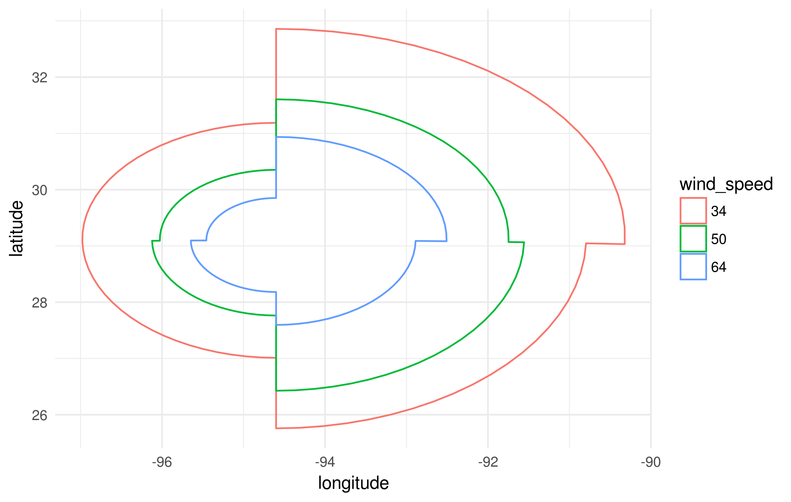

The rationale of this package is to grant peer-grading for the Coursera course of `Building Data Visualization Tools`. As a potentially useful byproduct, the code in this package contains a customized `stat/geom` pair named `*_hurricane` that can be used to visualize storm observation data. Particularly, provided data are arranged in an appropriate way, this `geom` draws the regions of a storm observation corresponding to the same wind speed level, for the four quadrants defined by an origin point. The contour of the "iso-speed" levels are connected by a `polygon` grid object.

***
## Introduction

The storm observation data that can be fed to `*_hurricane` functions are based on the dataset available at [Tropical cyclone EBTD](http://rammb.cira.colostate.edu/research/tropical_cyclones/tc_extended_best_track_dataset/). An R script describing the required data frame generating process is provided in the package. 

***
## Package content

The package contains the following *files* and **folders**:

- **R** -- includes the R scripts of the `{stat/geom}_hurricane` functions
- **man** -- includes the documentation of the `{stat/geom}_hurricane` functions, as well as the `ike` dataset provided along with the package
- **data** -- includes the `ike` dataset, generated by the *data_cleaner.R* script
- **resource** -- includes the *data_cleaner.R* script used to generate the appropriate data frame for the `{stat/geom}_hurricane` functions, as well as the *make_figure.R* script adopted to produce the Figure below
- **vignettes** -- includes this vignette
- **figures** -- includes the picture shown below, generated using the `geom_hurricane` function in the *make_figure.R* script
- *NAMESPACE* -- NAMESPACE file for this package
- *DESCRIPTION* -- package descritpion file
- *ike-13sep.png* -- picture (same as below) generated using the `geom_hurricane` function

***
<div class="figure">

<p class="caption">Ike storm observation with geom_hurricane. Data recorded at 06:00 of 13-Sep, 2008.</p>
</div>

***
## Code & Data

The reference data of the tropical cyclons is provided in the [EBTD database](http://rammb.cira.colostate.edu/research/tropical_cyclones/tc_extended_best_track_dataset/). The `ike` data frame constitutes a subset of the aforementioned database and is provided along with this package. The format of the data frame is different from the raw data and is strictly required by the `{stat/geom}_hurricane` functions. For convenience the `ike` data frame is shown below:


<div data-pagedtable="false">
  <script data-pagedtable-source type="application/json">
{"columns":[{"label":["storm_id"],"name":[1],"type":["chr"],"align":["left"]},{"label":["date"],"name":[2],"type":["chr"],"align":["left"]},{"label":["latitude"],"name":[3],"type":["dbl"],"align":["right"]},{"label":["longitude"],"name":[4],"type":["dbl"],"align":["right"]},{"label":["wind_speed"],"name":[5],"type":["chr"],"align":["left"]},{"label":["ne"],"name":[6],"type":["int"],"align":["right"]},{"label":["nw"],"name":[7],"type":["int"],"align":["right"]},{"label":["se"],"name":[8],"type":["int"],"align":["right"]},{"label":["sw"],"name":[9],"type":["int"],"align":["right"]}],"data":[{"1":"Ike-2008","2":"2008-09-01 06:00:00","3":"17.2","4":"-37.0","5":"34","6":"0","7":"0","8":"0","9":"0"},{"1":"Ike-2008","2":"2008-09-01 06:00:00","3":"17.2","4":"-37.0","5":"50","6":"0","7":"0","8":"0","9":"0"},{"1":"Ike-2008","2":"2008-09-01 06:00:00","3":"17.2","4":"-37.0","5":"64","6":"0","7":"0","8":"0","9":"0"},{"1":"Ike-2008","2":"2008-09-01 12:00:00","3":"17.3","4":"-38.4","5":"34","6":"120","7":"60","8":"75","9":"0"},{"1":"Ike-2008","2":"2008-09-01 12:00:00","3":"17.3","4":"-38.4","5":"50","6":"0","7":"0","8":"0","9":"0"},{"1":"Ike-2008","2":"2008-09-01 12:00:00","3":"17.3","4":"-38.4","5":"64","6":"0","7":"0","8":"0","9":"0"},{"1":"Ike-2008","2":"2008-09-01 18:00:00","3":"17.5","4":"-39.9","5":"34","6":"130","7":"75","8":"110","9":"0"},{"1":"Ike-2008","2":"2008-09-01 18:00:00","3":"17.5","4":"-39.9","5":"50","6":"0","7":"0","8":"0","9":"0"},{"1":"Ike-2008","2":"2008-09-01 18:00:00","3":"17.5","4":"-39.9","5":"64","6":"0","7":"0","8":"0","9":"0"},{"1":"Ike-2008","2":"2008-09-02 00:00:00","3":"17.8","4":"-41.3","5":"34","6":"140","7":"90","8":"120","9":"0"},{"1":"Ike-2008","2":"2008-09-02 00:00:00","3":"17.8","4":"-41.3","5":"50","6":"0","7":"0","8":"0","9":"0"},{"1":"Ike-2008","2":"2008-09-02 00:00:00","3":"17.8","4":"-41.3","5":"64","6":"0","7":"0","8":"0","9":"0"},{"1":"Ike-2008","2":"2008-09-02 06:00:00","3":"18.2","4":"-42.8","5":"34","6":"145","7":"120","8":"120","9":"0"},{"1":"Ike-2008","2":"2008-09-02 06:00:00","3":"18.2","4":"-42.8","5":"50","6":"0","7":"0","8":"0","9":"0"},{"1":"Ike-2008","2":"2008-09-02 06:00:00","3":"18.2","4":"-42.8","5":"64","6":"0","7":"0","8":"0","9":"0"},{"1":"Ike-2008","2":"2008-09-02 12:00:00","3":"18.7","4":"-44.3","5":"34","6":"150","7":"120","8":"120","9":"0"},{"1":"Ike-2008","2":"2008-09-02 12:00:00","3":"18.7","4":"-44.3","5":"50","6":"90","7":"0","8":"0","9":"0"},{"1":"Ike-2008","2":"2008-09-02 12:00:00","3":"18.7","4":"-44.3","5":"64","6":"0","7":"0","8":"0","9":"0"},{"1":"Ike-2008","2":"2008-09-02 18:00:00","3":"19.3","4":"-45.8","5":"34","6":"150","7":"120","8":"120","9":"45"},{"1":"Ike-2008","2":"2008-09-02 18:00:00","3":"19.3","4":"-45.8","5":"50","6":"90","7":"0","8":"0","9":"0"},{"1":"Ike-2008","2":"2008-09-02 18:00:00","3":"19.3","4":"-45.8","5":"64","6":"0","7":"0","8":"0","9":"0"},{"1":"Ike-2008","2":"2008-09-03 00:00:00","3":"19.8","4":"-47.3","5":"34","6":"150","7":"120","8":"115","9":"45"},{"1":"Ike-2008","2":"2008-09-03 00:00:00","3":"19.8","4":"-47.3","5":"50","6":"75","7":"30","8":"0","9":"0"},{"1":"Ike-2008","2":"2008-09-03 00:00:00","3":"19.8","4":"-47.3","5":"64","6":"0","7":"0","8":"0","9":"0"},{"1":"Ike-2008","2":"2008-09-03 06:00:00","3":"20.2","4":"-48.8","5":"34","6":"145","7":"120","8":"110","9":"45"},{"1":"Ike-2008","2":"2008-09-03 06:00:00","3":"20.2","4":"-48.8","5":"50","6":"75","7":"30","8":"0","9":"0"},{"1":"Ike-2008","2":"2008-09-03 06:00:00","3":"20.2","4":"-48.8","5":"64","6":"0","7":"0","8":"0","9":"0"},{"1":"Ike-2008","2":"2008-09-03 12:00:00","3":"20.6","4":"-50.3","5":"34","6":"135","7":"120","8":"105","9":"50"},{"1":"Ike-2008","2":"2008-09-03 12:00:00","3":"20.6","4":"-50.3","5":"50","6":"75","7":"40","8":"0","9":"0"},{"1":"Ike-2008","2":"2008-09-03 12:00:00","3":"20.6","4":"-50.3","5":"64","6":"0","7":"0","8":"0","9":"0"},{"1":"Ike-2008","2":"2008-09-03 18:00:00","3":"21.1","4":"-51.9","5":"34","6":"130","7":"120","8":"100","9":"60"},{"1":"Ike-2008","2":"2008-09-03 18:00:00","3":"21.1","4":"-51.9","5":"50","6":"75","7":"50","8":"50","9":"30"},{"1":"Ike-2008","2":"2008-09-03 18:00:00","3":"21.1","4":"-51.9","5":"64","6":"30","7":"0","8":"0","9":"0"},{"1":"Ike-2008","2":"2008-09-04 00:00:00","3":"21.8","4":"-53.5","5":"34","6":"120","7":"120","8":"100","9":"75"},{"1":"Ike-2008","2":"2008-09-04 00:00:00","3":"21.8","4":"-53.5","5":"50","6":"75","7":"50","8":"50","9":"40"},{"1":"Ike-2008","2":"2008-09-04 00:00:00","3":"21.8","4":"-53.5","5":"64","6":"30","7":"25","8":"25","9":"20"},{"1":"Ike-2008","2":"2008-09-04 06:00:00","3":"22.4","4":"-55.0","5":"34","6":"115","7":"120","8":"100","9":"90"},{"1":"Ike-2008","2":"2008-09-04 06:00:00","3":"22.4","4":"-55.0","5":"50","6":"75","7":"60","8":"50","9":"40"},{"1":"Ike-2008","2":"2008-09-04 06:00:00","3":"22.4","4":"-55.0","5":"64","6":"30","7":"25","8":"25","9":"20"},{"1":"Ike-2008","2":"2008-09-04 12:00:00","3":"23.0","4":"-56.4","5":"34","6":"110","7":"90","8":"95","9":"90"},{"1":"Ike-2008","2":"2008-09-04 12:00:00","3":"23.0","4":"-56.4","5":"50","6":"60","7":"50","8":"55","9":"40"},{"1":"Ike-2008","2":"2008-09-04 12:00:00","3":"23.0","4":"-56.4","5":"64","6":"40","7":"30","8":"30","9":"25"},{"1":"Ike-2008","2":"2008-09-04 18:00:00","3":"23.4","4":"-57.7","5":"34","6":"105","7":"85","8":"95","9":"90"},{"1":"Ike-2008","2":"2008-09-04 18:00:00","3":"23.4","4":"-57.7","5":"50","6":"60","7":"50","8":"55","9":"40"},{"1":"Ike-2008","2":"2008-09-04 18:00:00","3":"23.4","4":"-57.7","5":"64","6":"40","7":"30","8":"30","9":"25"},{"1":"Ike-2008","2":"2008-09-05 00:00:00","3":"23.6","4":"-59.0","5":"34","6":"105","7":"80","8":"95","9":"90"},{"1":"Ike-2008","2":"2008-09-05 00:00:00","3":"23.6","4":"-59.0","5":"50","6":"50","7":"50","8":"50","9":"40"},{"1":"Ike-2008","2":"2008-09-05 00:00:00","3":"23.6","4":"-59.0","5":"64","6":"40","7":"30","8":"30","9":"25"},{"1":"Ike-2008","2":"2008-09-05 06:00:00","3":"23.6","4":"-60.4","5":"34","6":"105","7":"85","8":"90","9":"90"},{"1":"Ike-2008","2":"2008-09-05 06:00:00","3":"23.6","4":"-60.4","5":"50","6":"50","7":"50","8":"50","9":"45"},{"1":"Ike-2008","2":"2008-09-05 06:00:00","3":"23.6","4":"-60.4","5":"64","6":"40","7":"30","8":"30","9":"30"},{"1":"Ike-2008","2":"2008-09-05 12:00:00","3":"23.5","4":"-61.9","5":"34","6":"105","7":"90","8":"90","9":"90"},{"1":"Ike-2008","2":"2008-09-05 12:00:00","3":"23.5","4":"-61.9","5":"50","6":"50","7":"50","8":"50","9":"45"},{"1":"Ike-2008","2":"2008-09-05 12:00:00","3":"23.5","4":"-61.9","5":"64","6":"40","7":"30","8":"30","9":"30"},{"1":"Ike-2008","2":"2008-09-05 18:00:00","3":"23.2","4":"-63.4","5":"34","6":"105","7":"105","8":"90","9":"90"},{"1":"Ike-2008","2":"2008-09-05 18:00:00","3":"23.2","4":"-63.4","5":"50","6":"50","7":"50","8":"50","9":"45"},{"1":"Ike-2008","2":"2008-09-05 18:00:00","3":"23.2","4":"-63.4","5":"64","6":"40","7":"35","8":"35","9":"30"},{"1":"Ike-2008","2":"2008-09-06 00:00:00","3":"22.8","4":"-64.9","5":"34","6":"105","7":"110","8":"90","9":"90"},{"1":"Ike-2008","2":"2008-09-06 00:00:00","3":"22.8","4":"-64.9","5":"50","6":"50","7":"50","8":"50","9":"45"},{"1":"Ike-2008","2":"2008-09-06 00:00:00","3":"22.8","4":"-64.9","5":"64","6":"40","7":"35","8":"35","9":"30"},{"1":"Ike-2008","2":"2008-09-06 06:00:00","3":"22.4","4":"-66.3","5":"34","6":"105","7":"115","8":"90","9":"90"},{"1":"Ike-2008","2":"2008-09-06 06:00:00","3":"22.4","4":"-66.3","5":"50","6":"60","7":"50","8":"50","9":"45"},{"1":"Ike-2008","2":"2008-09-06 06:00:00","3":"22.4","4":"-66.3","5":"64","6":"40","7":"35","8":"35","9":"30"},{"1":"Ike-2008","2":"2008-09-06 12:00:00","3":"21.9","4":"-67.7","5":"34","6":"110","7":"120","8":"90","9":"90"},{"1":"Ike-2008","2":"2008-09-06 12:00:00","3":"21.9","4":"-67.7","5":"50","6":"60","7":"50","8":"60","9":"45"},{"1":"Ike-2008","2":"2008-09-06 12:00:00","3":"21.9","4":"-67.7","5":"64","6":"40","7":"35","8":"35","9":"30"},{"1":"Ike-2008","2":"2008-09-06 18:00:00","3":"21.5","4":"-69.0","5":"34","6":"115","7":"125","8":"95","9":"100"},{"1":"Ike-2008","2":"2008-09-06 18:00:00","3":"21.5","4":"-69.0","5":"50","6":"60","7":"60","8":"70","9":"45"},{"1":"Ike-2008","2":"2008-09-06 18:00:00","3":"21.5","4":"-69.0","5":"64","6":"40","7":"35","8":"35","9":"30"},{"1":"Ike-2008","2":"2008-09-07 00:00:00","3":"21.2","4":"-70.3","5":"34","6":"120","7":"125","8":"100","9":"100"},{"1":"Ike-2008","2":"2008-09-07 00:00:00","3":"21.2","4":"-70.3","5":"50","6":"75","7":"60","8":"75","9":"50"},{"1":"Ike-2008","2":"2008-09-07 00:00:00","3":"21.2","4":"-70.3","5":"64","6":"40","7":"35","8":"40","9":"30"},{"1":"Ike-2008","2":"2008-09-07 06:00:00","3":"21.1","4":"-71.6","5":"34","6":"130","7":"125","8":"110","9":"100"},{"1":"Ike-2008","2":"2008-09-07 06:00:00","3":"21.1","4":"-71.6","5":"50","6":"75","7":"75","8":"75","9":"50"},{"1":"Ike-2008","2":"2008-09-07 06:00:00","3":"21.1","4":"-71.6","5":"64","6":"40","7":"40","8":"40","9":"30"},{"1":"Ike-2008","2":"2008-09-07 12:00:00","3":"21.0","4":"-72.8","5":"34","6":"140","7":"125","8":"120","9":"100"},{"1":"Ike-2008","2":"2008-09-07 12:00:00","3":"21.0","4":"-72.8","5":"50","6":"90","7":"75","8":"75","9":"50"},{"1":"Ike-2008","2":"2008-09-07 12:00:00","3":"21.0","4":"-72.8","5":"64","6":"50","7":"50","8":"40","9":"30"},{"1":"Ike-2008","2":"2008-09-07 18:00:00","3":"21.0","4":"-74.0","5":"34","6":"145","7":"125","8":"125","9":"100"},{"1":"Ike-2008","2":"2008-09-07 18:00:00","3":"21.0","4":"-74.0","5":"50","6":"90","7":"75","8":"90","9":"50"},{"1":"Ike-2008","2":"2008-09-07 18:00:00","3":"21.0","4":"-74.0","5":"64","6":"50","7":"50","8":"40","9":"30"},{"1":"Ike-2008","2":"2008-09-08 00:00:00","3":"21.1","4":"-75.2","5":"34","6":"150","7":"125","8":"140","9":"100"},{"1":"Ike-2008","2":"2008-09-08 00:00:00","3":"21.1","4":"-75.2","5":"50","6":"90","7":"75","8":"105","9":"50"},{"1":"Ike-2008","2":"2008-09-08 00:00:00","3":"21.1","4":"-75.2","5":"64","6":"50","7":"50","8":"40","9":"30"},{"1":"Ike-2008","2":"2008-09-08 06:00:00","3":"21.1","4":"-76.5","5":"34","6":"155","7":"125","8":"175","9":"100"},{"1":"Ike-2008","2":"2008-09-08 06:00:00","3":"21.1","4":"-76.5","5":"50","6":"90","7":"75","8":"120","9":"50"},{"1":"Ike-2008","2":"2008-09-08 06:00:00","3":"21.1","4":"-76.5","5":"64","6":"50","7":"50","8":"40","9":"30"},{"1":"Ike-2008","2":"2008-09-08 12:00:00","3":"21.1","4":"-77.8","5":"34","6":"155","7":"125","8":"180","9":"100"},{"1":"Ike-2008","2":"2008-09-08 12:00:00","3":"21.1","4":"-77.8","5":"50","6":"90","7":"60","8":"120","9":"50"},{"1":"Ike-2008","2":"2008-09-08 12:00:00","3":"21.1","4":"-77.8","5":"64","6":"40","7":"45","8":"40","9":"30"},{"1":"Ike-2008","2":"2008-09-08 18:00:00","3":"21.2","4":"-79.1","5":"34","6":"155","7":"125","8":"180","9":"100"},{"1":"Ike-2008","2":"2008-09-08 18:00:00","3":"21.2","4":"-79.1","5":"50","6":"90","7":"45","8":"120","9":"30"},{"1":"Ike-2008","2":"2008-09-08 18:00:00","3":"21.2","4":"-79.1","5":"64","6":"30","7":"30","8":"30","9":"0"},{"1":"Ike-2008","2":"2008-09-09 00:00:00","3":"21.5","4":"-80.3","5":"34","6":"155","7":"150","8":"180","9":"100"},{"1":"Ike-2008","2":"2008-09-09 00:00:00","3":"21.5","4":"-80.3","5":"50","6":"90","7":"60","8":"90","9":"30"},{"1":"Ike-2008","2":"2008-09-09 00:00:00","3":"21.5","4":"-80.3","5":"64","6":"30","7":"30","8":"30","9":"0"},{"1":"Ike-2008","2":"2008-09-09 06:00:00","3":"22.0","4":"-81.4","5":"34","6":"155","7":"170","8":"160","9":"100"},{"1":"Ike-2008","2":"2008-09-09 06:00:00","3":"22.0","4":"-81.4","5":"50","6":"90","7":"75","8":"75","9":"30"},{"1":"Ike-2008","2":"2008-09-09 06:00:00","3":"22.0","4":"-81.4","5":"64","6":"30","7":"30","8":"30","9":"0"},{"1":"Ike-2008","2":"2008-09-09 12:00:00","3":"22.4","4":"-82.4","5":"34","6":"155","7":"170","8":"155","9":"100"},{"1":"Ike-2008","2":"2008-09-09 12:00:00","3":"22.4","4":"-82.4","5":"50","6":"90","7":"90","8":"75","9":"30"},{"1":"Ike-2008","2":"2008-09-09 12:00:00","3":"22.4","4":"-82.4","5":"64","6":"30","7":"30","8":"0","9":"0"},{"1":"Ike-2008","2":"2008-09-09 18:00:00","3":"22.7","4":"-83.3","5":"34","6":"155","7":"170","8":"150","9":"105"},{"1":"Ike-2008","2":"2008-09-09 18:00:00","3":"22.7","4":"-83.3","5":"50","6":"100","7":"90","8":"75","9":"30"},{"1":"Ike-2008","2":"2008-09-09 18:00:00","3":"22.7","4":"-83.3","5":"64","6":"20","7":"30","8":"0","9":"0"},{"1":"Ike-2008","2":"2008-09-10 00:00:00","3":"23.1","4":"-84.0","5":"34","6":"160","7":"180","8":"150","9":"110"},{"1":"Ike-2008","2":"2008-09-10 00:00:00","3":"23.1","4":"-84.0","5":"50","6":"100","7":"90","8":"75","9":"30"},{"1":"Ike-2008","2":"2008-09-10 00:00:00","3":"23.1","4":"-84.0","5":"64","6":"30","7":"20","8":"0","9":"0"},{"1":"Ike-2008","2":"2008-09-10 06:00:00","3":"23.4","4":"-84.6","5":"34","6":"170","7":"180","8":"150","9":"115"},{"1":"Ike-2008","2":"2008-09-10 06:00:00","3":"23.4","4":"-84.6","5":"50","6":"110","7":"90","8":"75","9":"45"},{"1":"Ike-2008","2":"2008-09-10 06:00:00","3":"23.4","4":"-84.6","5":"64","6":"45","7":"20","8":"0","9":"0"},{"1":"Ike-2008","2":"2008-09-10 12:00:00","3":"23.8","4":"-85.2","5":"34","6":"180","7":"180","8":"155","9":"120"},{"1":"Ike-2008","2":"2008-09-10 12:00:00","3":"23.8","4":"-85.2","5":"50","6":"120","7":"100","8":"80","9":"60"},{"1":"Ike-2008","2":"2008-09-10 12:00:00","3":"23.8","4":"-85.2","5":"64","6":"75","7":"45","8":"20","9":"15"},{"1":"Ike-2008","2":"2008-09-10 18:00:00","3":"24.2","4":"-85.8","5":"34","6":"195","7":"180","8":"160","9":"120"},{"1":"Ike-2008","2":"2008-09-10 18:00:00","3":"24.2","4":"-85.8","5":"50","6":"130","7":"110","8":"90","9":"75"},{"1":"Ike-2008","2":"2008-09-10 18:00:00","3":"24.2","4":"-85.8","5":"64","6":"90","7":"60","8":"40","9":"30"},{"1":"Ike-2008","2":"2008-09-11 00:00:00","3":"24.7","4":"-86.4","5":"34","6":"210","7":"180","8":"170","9":"120"},{"1":"Ike-2008","2":"2008-09-11 00:00:00","3":"24.7","4":"-86.4","5":"50","6":"140","7":"125","8":"105","9":"90"},{"1":"Ike-2008","2":"2008-09-11 00:00:00","3":"24.7","4":"-86.4","5":"64","6":"100","7":"75","8":"60","9":"30"},{"1":"Ike-2008","2":"2008-09-11 06:00:00","3":"25.1","4":"-87.1","5":"34","6":"220","7":"180","8":"190","9":"130"},{"1":"Ike-2008","2":"2008-09-11 06:00:00","3":"25.1","4":"-87.1","5":"50","6":"150","7":"140","8":"120","9":"90"},{"1":"Ike-2008","2":"2008-09-11 06:00:00","3":"25.1","4":"-87.1","5":"64","6":"100","7":"75","8":"75","9":"30"},{"1":"Ike-2008","2":"2008-09-11 12:00:00","3":"25.5","4":"-88.0","5":"34","6":"230","7":"180","8":"240","9":"150"},{"1":"Ike-2008","2":"2008-09-11 12:00:00","3":"25.5","4":"-88.0","5":"50","6":"150","7":"140","8":"135","9":"90"},{"1":"Ike-2008","2":"2008-09-11 12:00:00","3":"25.5","4":"-88.0","5":"64","6":"100","7":"60","8":"75","9":"30"},{"1":"Ike-2008","2":"2008-09-11 18:00:00","3":"25.8","4":"-88.9","5":"34","6":"240","7":"180","8":"240","9":"150"},{"1":"Ike-2008","2":"2008-09-11 18:00:00","3":"25.8","4":"-88.9","5":"50","6":"150","7":"140","8":"150","9":"90"},{"1":"Ike-2008","2":"2008-09-11 18:00:00","3":"25.8","4":"-88.9","5":"64","6":"100","7":"60","8":"75","9":"30"},{"1":"Ike-2008","2":"2008-09-12 00:00:00","3":"26.1","4":"-90.0","5":"34","6":"240","7":"180","8":"230","9":"150"},{"1":"Ike-2008","2":"2008-09-12 00:00:00","3":"26.1","4":"-90.0","5":"50","6":"150","7":"140","8":"150","9":"100"},{"1":"Ike-2008","2":"2008-09-12 00:00:00","3":"26.1","4":"-90.0","5":"64","6":"100","7":"60","8":"75","9":"60"},{"1":"Ike-2008","2":"2008-09-12 06:00:00","3":"26.4","4":"-91.1","5":"34","6":"240","7":"180","8":"215","9":"150"},{"1":"Ike-2008","2":"2008-09-12 06:00:00","3":"26.4","4":"-91.1","5":"50","6":"150","7":"140","8":"150","9":"100"},{"1":"Ike-2008","2":"2008-09-12 06:00:00","3":"26.4","4":"-91.1","5":"64","6":"105","7":"60","8":"75","9":"60"},{"1":"Ike-2008","2":"2008-09-12 12:00:00","3":"26.9","4":"-92.2","5":"34","6":"240","7":"180","8":"210","9":"150"},{"1":"Ike-2008","2":"2008-09-12 12:00:00","3":"26.9","4":"-92.2","5":"50","6":"150","7":"140","8":"150","9":"100"},{"1":"Ike-2008","2":"2008-09-12 12:00:00","3":"26.9","4":"-92.2","5":"64","6":"105","7":"60","8":"75","9":"60"},{"1":"Ike-2008","2":"2008-09-12 18:00:00","3":"27.5","4":"-93.2","5":"34","6":"240","7":"175","8":"205","9":"150"},{"1":"Ike-2008","2":"2008-09-12 18:00:00","3":"27.5","4":"-93.2","5":"50","6":"150","7":"105","8":"150","9":"90"},{"1":"Ike-2008","2":"2008-09-12 18:00:00","3":"27.5","4":"-93.2","5":"64","6":"105","7":"75","8":"90","9":"60"},{"1":"Ike-2008","2":"2008-09-13 00:00:00","3":"28.3","4":"-94.0","5":"34","6":"240","7":"170","8":"200","9":"150"},{"1":"Ike-2008","2":"2008-09-13 00:00:00","3":"28.3","4":"-94.0","5":"50","6":"150","7":"90","8":"160","9":"80"},{"1":"Ike-2008","2":"2008-09-13 00:00:00","3":"28.3","4":"-94.0","5":"64","6":"110","7":"75","8":"90","9":"60"},{"1":"Ike-2008","2":"2008-09-13 06:00:00","3":"29.1","4":"-94.6","5":"34","6":"225","7":"125","8":"200","9":"125"},{"1":"Ike-2008","2":"2008-09-13 06:00:00","3":"29.1","4":"-94.6","5":"50","6":"150","7":"75","8":"160","9":"80"},{"1":"Ike-2008","2":"2008-09-13 06:00:00","3":"29.1","4":"-94.6","5":"64","6":"110","7":"45","8":"90","9":"55"},{"1":"Ike-2008","2":"2008-09-13 12:00:00","3":"30.3","4":"-95.2","5":"34","6":"125","7":"60","8":"180","9":"125"},{"1":"Ike-2008","2":"2008-09-13 12:00:00","3":"30.3","4":"-95.2","5":"50","6":"75","7":"45","8":"90","9":"60"},{"1":"Ike-2008","2":"2008-09-13 12:00:00","3":"30.3","4":"-95.2","5":"64","6":"50","7":"20","8":"45","9":"30"},{"1":"Ike-2008","2":"2008-09-13 18:00:00","3":"31.7","4":"-95.3","5":"34","6":"75","7":"40","8":"150","9":"60"},{"1":"Ike-2008","2":"2008-09-13 18:00:00","3":"31.7","4":"-95.3","5":"50","6":"40","7":"0","8":"45","9":"0"},{"1":"Ike-2008","2":"2008-09-13 18:00:00","3":"31.7","4":"-95.3","5":"64","6":"0","7":"0","8":"0","9":"0"},{"1":"Ike-2008","2":"2008-09-14 00:00:00","3":"33.5","4":"-94.9","5":"34","6":"60","7":"0","8":"90","9":"0"},{"1":"Ike-2008","2":"2008-09-14 00:00:00","3":"33.5","4":"-94.9","5":"50","6":"0","7":"0","8":"0","9":"0"},{"1":"Ike-2008","2":"2008-09-14 00:00:00","3":"33.5","4":"-94.9","5":"64","6":"0","7":"0","8":"0","9":"0"},{"1":"Ike-2008","2":"2008-09-14 06:00:00","3":"35.5","4":"-93.7","5":"34","6":"45","7":"0","8":"90","9":"20"},{"1":"Ike-2008","2":"2008-09-14 06:00:00","3":"35.5","4":"-93.7","5":"50","6":"0","7":"0","8":"0","9":"0"},{"1":"Ike-2008","2":"2008-09-14 06:00:00","3":"35.5","4":"-93.7","5":"64","6":"0","7":"0","8":"0","9":"0"},{"1":"Ike-2008","2":"2008-09-14 12:00:00","3":"37.6","4":"-91.0","5":"34","6":"0","7":"0","8":"90","9":"40"},{"1":"Ike-2008","2":"2008-09-14 12:00:00","3":"37.6","4":"-91.0","5":"50","6":"0","7":"0","8":"0","9":"0"},{"1":"Ike-2008","2":"2008-09-14 12:00:00","3":"37.6","4":"-91.0","5":"64","6":"0","7":"0","8":"0","9":"0"},{"1":"Ike-2008","2":"2008-09-14 18:00:00","3":"40.3","4":"-87.2","5":"34","6":"0","7":"0","8":"180","9":"150"},{"1":"Ike-2008","2":"2008-09-14 18:00:00","3":"40.3","4":"-87.2","5":"50","6":"0","7":"0","8":"160","9":"0"},{"1":"Ike-2008","2":"2008-09-14 18:00:00","3":"40.3","4":"-87.2","5":"64","6":"0","7":"0","8":"0","9":"0"},{"1":"Ike-2008","2":"2008-09-15 00:00:00","3":"43.3","4":"-81.5","5":"34","6":"0","7":"0","8":"180","9":"150"},{"1":"Ike-2008","2":"2008-09-15 00:00:00","3":"43.3","4":"-81.5","5":"50","6":"0","7":"0","8":"160","9":"0"},{"1":"Ike-2008","2":"2008-09-15 00:00:00","3":"43.3","4":"-81.5","5":"64","6":"0","7":"0","8":"0","9":"0"},{"1":"Ike-2008","2":"2008-09-15 06:00:00","3":"45.8","4":"-75.3","5":"34","6":"0","7":"0","8":"180","9":"150"},{"1":"Ike-2008","2":"2008-09-15 06:00:00","3":"45.8","4":"-75.3","5":"50","6":"0","7":"0","8":"0","9":"0"},{"1":"Ike-2008","2":"2008-09-15 06:00:00","3":"45.8","4":"-75.3","5":"64","6":"0","7":"0","8":"0","9":"0"},{"1":"Ike-2008","2":"2008-09-15 12:00:00","3":"47.2","4":"-71.1","5":"34","6":"0","7":"0","8":"180","9":"150"},{"1":"Ike-2008","2":"2008-09-15 12:00:00","3":"47.2","4":"-71.1","5":"50","6":"0","7":"0","8":"0","9":"0"},{"1":"Ike-2008","2":"2008-09-15 12:00:00","3":"47.2","4":"-71.1","5":"64","6":"0","7":"0","8":"0","9":"0"}],"options":{"columns":{"min":{},"max":[10]},"rows":{"min":[10],"max":[10]},"pages":{}}}
  </script>
</div>

The `ike` data frame is generated with the following code (see the *data_cleaner.R* script, in the **resource** folder):


```r
# Load and tidy ebrtk data
#
library(magrittr)
library(dplyr)
library(readr)
library(tidyr)
library(stringr)
library(lubridate)
#
# read source data
ext_tracks_widths <- c(7, 10, 2, 2, 3, 5, 5, 6, 4, 5, 4, 4, 5, 3, 4, 3, 3, 3,
                       4, 3, 3, 3, 4, 3, 3, 3, 2, 6, 1)
ext_tracks_colnames <- c("storm_id", "storm_name", "month", "day",
                         "hour", "year", "latitude", "longitude",
                         "max_wind", "min_pressure", "rad_max_wind",
                         "eye_diameter", "pressure_1", "pressure_2",
                         paste("radius_34", c("ne", "se", "sw", "nw"), sep = "_"),
                         paste("radius_50", c("ne", "se", "sw", "nw"), sep = "_"),
                         paste("radius_64", c("ne", "se", "sw", "nw"), sep = "_"),
                         "storm_type", "distance_to_land", "final")
ext_tracks <- read_fwf("ebtrk_atlc_1988_2015.txt",
                       fwf_widths(ext_tracks_widths, ext_tracks_colnames),
                       na = "-99")
#
# refactor quadrant radii
features <- c("storm_name", "year", "month", "day", "hour", "latitude", "longitude")
tmp <- ext_tracks %>% select(features, starts_with("radius_")) %>%
    filter(storm_name == "IKE") %>%
    gather(key, value, -features) %>%
    extract(key, c("wind_speed", "quadrant"), "(\\d+)_(..)") %>%
    spread(quadrant, value)
#
# add (remove) new (old) features
ike <- tmp %>% mutate(date = as.character(make_datetime(as.integer(year), as.integer(month),
                                                        as.integer(day), as.integer(hour)))) %>%
    mutate(longitude = -longitude) %>%
    mutate(storm_id = paste(str_to_title(storm_name), year, sep = "-")) %>%
    select(storm_id, date, latitude, longitude, wind_speed, ne, nw, se, sw)
```

The `stat_hurricane` function builds the points, which form the contours of the wind radii, by means of the \link[geosphere]{destPoint} function. `geom_hurricane` inherits from `geom_polygon`. The default `geom` associated to `stat_hurricane` is `geom_hurricane`, as shown by the following code chunk:


```r
library(ggplot2)

ike_1 <- ike %>% dplyr::filter(latitude > 29 & latitude < 30)
ggplot(data = ike_1, mapping = aes(x = longitude, y = latitude)) +
    stat_hurricane(mapping = aes(x = longitude, y = latitude, r_ne = ne, r_se = se, r_sw = sw,
                                 r_nw = nw, colour = wind_speed), alpha = 0) +
    theme_minimal()
```

***
<div class="figure">

<p class="caption">Simple usage of stat_hurricane</p>
</div>

***
## Warning

When adding a `geom_hurricane` layer on top of a map object, as in the first figure, the boundaries of the latitude and longitude of the complete picture map is determined by the map object. In this case, if any points of the wind radii computed by `geom_hurricane` exceed those limits, the resulting plot will be incorrect. It is advised to use the `scale_radii` aestethic to reduce the size of the `geom_hurricane` polygons or to use a less zoomed-in map object.

***
## References

- R.D. Peng, S. Kross, and B. Anderson, “*Mastering Software Development in R*”, section 4.7: [Building New Graphical Elements](http://rdpeng.github.io/RProgDA/building-new-graphical-elements.html)
- Documentation of the `ggplot2::geom_polygon` function, [version 2.2.1.9000](http://ggplot2.tidyverse.org/reference/geom_polygon.html)
- Vignette from the `ggplot2` package, [Extending ggplot2](https://cran.r-project.org/web/packages/ggplot2/vignettes/extending-ggplot2.html)
- Vignette from the `geosphere` package, [Introduction to the geosphere package](https://cran.r-project.org/web/packages/geosphere/vignettes/geosphere.pdf)

***
