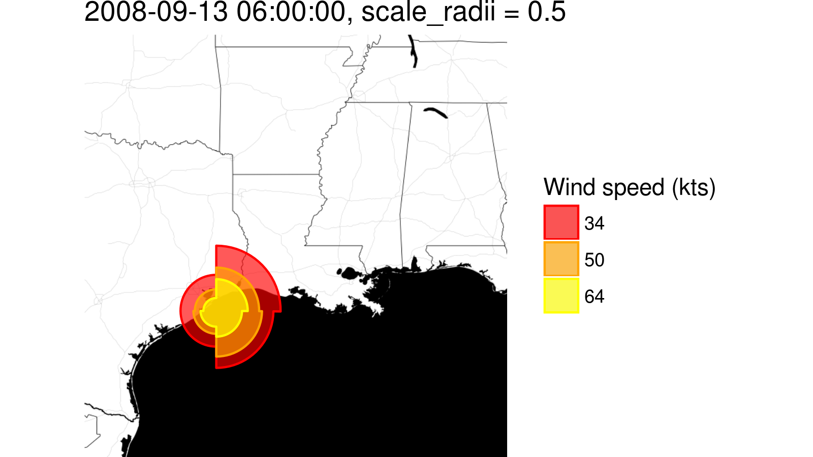
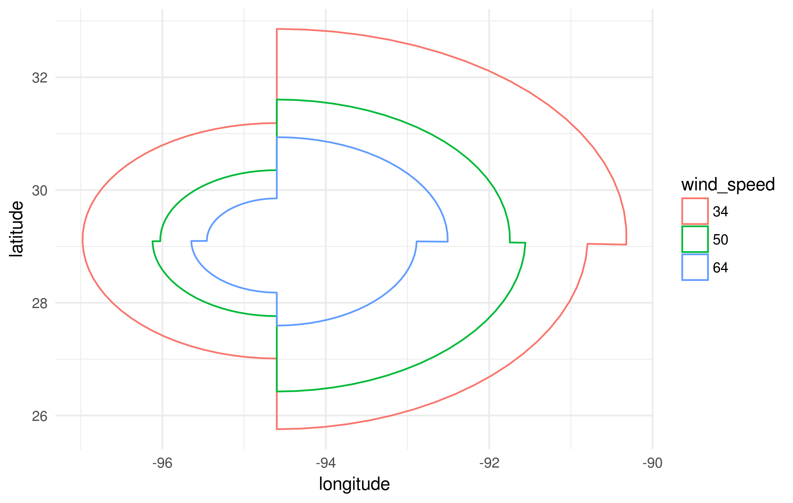

The rationale of this package is to grant peer-grading for the Coursera course of `Building Data Visualization Tools`. As a potentially useful byproduct, the code in this package contains a customized `stat/geom` pair named `*_hurricane` that can be used to visualize storm observation data. Particularly, provided data are arranged in an appropriate way, this `geom` draws the regions of a storm observation corresponding to the same wind speed level, for the four quadrants defined by an origin point. The contour of the "iso-speed" levels are connected by a `polygon` grid object.

***
## Introduction

The storm observation data that can be fed to `*_hurricane` functions are based on the dataset available at [Tropical cyclone EBTD](http://rammb.cira.colostate.edu/research/tropical_cyclones/tc_extended_best_track_dataset/). An R script describing the required data frame generating process is provided in the package. 

***
## Package content

The package contains the following *files* and **folders**:

- **R** -- includes the R scripts of the `{stat/geom}_hurricane` functions
- **man** -- includes the documentation of the `{stat/geom}_hurricane` functions, as well as the `ike` dataset provided along with the package
- **data** -- includes the `ike` dataset, generated by the *data_cleaner.R* script
- **resource** -- includes the *data_cleaner.R* script used to generate the appropriate data frame for the `{stat/geom}_hurricane` functions, as well as the *make_figure.R* script adopted to produce the Figure below
- **vignettes** -- includes this vignette
- **figures** -- includes the picture shown below, generated using the `geom_hurricane` function in the *make_figure.R* script
- *NAMESPACE* -- NAMESPACE file for this package
- *DESCRIPTION* -- package descritpion file
- *ike-13sep.png* -- picture (same as below) generated using the `geom_hurricane` function

***
<div class="figure">

<p class="caption">Ike storm observation with geom_hurricane. Data recorded at 06:00 of 13-Sep, 2008.</p>
</div>

***
## Code & Data

The reference data of the tropical cyclons is provided in the [EBTD database](http://rammb.cira.colostate.edu/research/tropical_cyclones/tc_extended_best_track_dataset/). The `ike` data frame constitutes a subset of the aforementioned database and is provided along with this package. The format of the data frame is different from the raw data and is strictly required by the `{stat/geom}_hurricane` functions. For convenience the `ike` data frame is shown below:


```
#> # A tibble: 174 x 9
#>    storm_id date     latitude longitude wind_speed    ne    nw    se    sw
#>    <chr>    <chr>       <dbl>     <dbl> <chr>      <int> <int> <int> <int>
#>  1 Ike-2008 2008-09…     17.2     -37.0 34             0     0     0     0
#>  2 Ike-2008 2008-09…     17.2     -37.0 50             0     0     0     0
#>  3 Ike-2008 2008-09…     17.2     -37.0 64             0     0     0     0
#>  4 Ike-2008 2008-09…     17.3     -38.4 34           120    60    75     0
#>  5 Ike-2008 2008-09…     17.3     -38.4 50             0     0     0     0
#>  6 Ike-2008 2008-09…     17.3     -38.4 64             0     0     0     0
#>  7 Ike-2008 2008-09…     17.5     -39.9 34           130    75   110     0
#>  8 Ike-2008 2008-09…     17.5     -39.9 50             0     0     0     0
#>  9 Ike-2008 2008-09…     17.5     -39.9 64             0     0     0     0
#> 10 Ike-2008 2008-09…     17.8     -41.3 34           140    90   120     0
#> # ... with 164 more rows
```

The `ike` data frame is generated with the following code (see the *data_cleaner.R* script, in the **resource** folder):


```r
# Load and tidy ebrtk data
#
library(magrittr)
library(dplyr)
library(readr)
library(tidyr)
library(stringr)
library(lubridate)
#
# read source data
ext_tracks_widths <- c(7, 10, 2, 2, 3, 5, 5, 6, 4, 5, 4, 4, 5, 3, 4, 3, 3, 3,
                       4, 3, 3, 3, 4, 3, 3, 3, 2, 6, 1)
ext_tracks_colnames <- c("storm_id", "storm_name", "month", "day",
                         "hour", "year", "latitude", "longitude",
                         "max_wind", "min_pressure", "rad_max_wind",
                         "eye_diameter", "pressure_1", "pressure_2",
                         paste("radius_34", c("ne", "se", "sw", "nw"), sep = "_"),
                         paste("radius_50", c("ne", "se", "sw", "nw"), sep = "_"),
                         paste("radius_64", c("ne", "se", "sw", "nw"), sep = "_"),
                         "storm_type", "distance_to_land", "final")
ext_tracks <- read_fwf("ebtrk_atlc_1988_2015.txt",
                       fwf_widths(ext_tracks_widths, ext_tracks_colnames),
                       na = "-99")
#
# refactor quadrant radii
features <- c("storm_name", "year", "month", "day", "hour", "latitude", "longitude")
tmp <- ext_tracks %>% select(features, starts_with("radius_")) %>%
    filter(storm_name == "IKE") %>%
    gather(key, value, -features) %>%
    extract(key, c("wind_speed", "quadrant"), "(\\d+)_(..)") %>%
    spread(quadrant, value)
#
# add (remove) new (old) features
ike <- tmp %>% mutate(date = as.character(make_datetime(as.integer(year), as.integer(month),
                                                        as.integer(day), as.integer(hour)))) %>%
    mutate(longitude = -longitude) %>%
    mutate(storm_id = paste(str_to_title(storm_name), year, sep = "-")) %>%
    select(storm_id, date, latitude, longitude, wind_speed, ne, nw, se, sw)
```

The `stat_hurricane` function builds the points, which form the contours of the wind radii, by means of the \link[geosphere]{destPoint} function. `geom_hurricane` inherits from `geom_polygon`. The default `geom` associated to `stat_hurricane` is `geom_hurricane`, as shown by the following code chunk:


```r
library(ggplot2)

ike_1 <- ike %>% dplyr::filter(latitude > 29 & latitude < 30)
ggplot(data = ike_1, mapping = aes(x = longitude, y = latitude)) +
    stat_hurricane(mapping = aes(x = longitude, y = latitude, r_ne = ne, r_se = se, r_sw = sw,
                                 r_nw = nw, colour = wind_speed), alpha = 0) +
    theme_minimal()
```

***
<div class="figure">

<p class="caption">Simple usage of stat_hurricane</p>
</div>

***
## Warning

When adding a `geom_hurricane` layer on top of a map object, as in the first figure, the boundaries of the latitude and longitude of the complete picture map is determined by the map object. In this case, if any points of the wind radii computed by `geom_hurricane` exceed those limits, the resulting plot will be incorrect. It is advised to use the `scale_radii` aestethic to reduce the size of the `geom_hurricane` polygons or to use a less zoomed-in map object.

***
## References

- R.D. Peng, S. Kross, and B. Anderson, “*Mastering Software Development in R*”, section 4.7: [Building New Graphical Elements](http://rdpeng.github.io/RProgDA/building-new-graphical-elements.html)
- Documentation of the `ggplot2::geom_polygon` function, [version 2.2.1.9000](http://ggplot2.tidyverse.org/reference/geom_polygon.html)
- Vignette from the `ggplot2` package, [Extending ggplot2](https://cran.r-project.org/web/packages/ggplot2/vignettes/extending-ggplot2.html)
- Vignette from the `geosphere` package, [Introduction to the geosphere package](https://cran.r-project.org/web/packages/geosphere/vignettes/geosphere.pdf)

***
